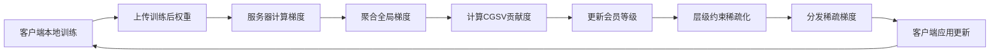

# 联邦学习层级约束动态梯度奖励机制

## Federated Learning with Tier-Constrained Dynamic Gradient Reward

一个基于梯度驱动奖励的公平联邦学习激励机制实现，支持多种Non-IID场景和评估指标。
---

## 📑 目录

- [项目概述](#项目概述)
- [核心创新](#核心创新)
- [理论基础](#理论基础)
- [技术架构](#技术架构)
- [环境配置](#环境配置)
- [快速开始](#快速开始)
- [详细使用指南](#详细使用指南)
- [实验场景](#实验场景)
- [评估指标](#评估指标)
- [项目结构](#项目结构)
- [配置说明](#配置说明)
- [可视化结果](#可视化结果)
- [常见问题](#常见问题)
- [引用](#引用)
- [许可证](#许可证)

---

## 🎯 项目概述

本项目实现了一个创新的联邦学习激励机制 —— **层级约束动态梯度奖励（Tier-Constrained Dynamic Gradient Reward）**，旨在解决联邦学习中的公平性问题，确保不同数据质量的客户端都能从联邦学习中受益。

### 核心思想

传统联邦学习中，高质量数据的客户端往往对全局模型贡献更大，但低质量数据的客户端可能无法从联邦学习中获益，甚至性能下降。本项目通过**差异化梯度分发**机制：
- 高贡献客户端获得更完整的模型更新
- 低贡献客户端获得稀疏化的模型更新
- 通过层级约束确保激励机制的公平性和有效性

### 基于论文

本实现基于 NeurIPS 2021 论文：
> **"Gradient-Driven Rewards to Guarantee Fairness in Collaborative Machine Learning"**

并在此基础上进行了重要扩展和优化。

---

## 🚀 核心创新

### 1. 层级约束稀疏化（Tier-Constrained Sparsification）

**传统方法的问题**：固定稀疏率无法反映客户端贡献度的细微差异

**本项目的解决方案**：
```
传统方法：Gold = 80% 保留率（固定）
         Silver = 50% 保留率（固定）
         Bronze = 30% 保留率（固定）

本项目：Gold = [80%, 100%] 保留率范围
       Silver = [50%, 80%] 保留率范围
       Bronze = [10%, 50%] 保留率范围
       + 组内插值实现连续映射
```

### 2. 组内线性插值（Intra-Tier Interpolation）

在每个层级内部，根据客户端的相对贡献度进行线性插值：

```
相对位置 P_i = (φ_i - min(φ ∈ L)) / (max(φ ∈ L) - min(φ ∈ L))
保留率 s_i = S^L_low + P_i × (S^L_high - S^L_low)
```

这使得即使在同一层级内，不同贡献度的客户端也能获得差异化的模型更新。

### 3. 基于幅度的稀疏化（Magnitude-Based Pruning）

保留梯度中绝对值最大的参数，确保即使低质量客户端获得稀疏更新，也能获取模型最重要的特征：

```python
# 选择 top-k 重要参数
abs_grad = torch.abs(gradient)
threshold = torch.topk(abs_grad, num_keep).values[-1]
sparse_gradient = gradient * (abs_grad >= threshold)
```

### 4. 贡献度加权聚合（Contribution-Aware Aggregation）

使用 Softmax 归一化的贡献度作为聚合权重，而非简单的样本数量：

```
w_i = exp(β * φ_i) / Σ exp(β * φ_k)
Δw_global = Σ w_i * Δw_i
```

---

## 📚 理论基础

### CGSV（Cosine Gradient Shapley Value）

本项目使用余弦相似度近似 Shapley Value 来计算客户端贡献度：

```
CGSV_i ≈ cos(Δw_i, Δw_global) = (Δw_i · Δw_global) / (||Δw_i|| × ||Δw_global||)
```

**优势**：
- 计算复杂度低：O(n) vs Shapley Value 的 O(2^n)
- 可解释性强：直接反映梯度方向的一致性
- 归一化到 [0, 1]：便于跨轮次比较

### 三级会员系统

基于累积信誉分（Accumulated Reputation）的相对排名：

| 等级 | 排名百分位 | 保留率范围 | 比例 |
|------|-----------|-----------|------|
| **Gold** | ≥ 80% | [80%, 100%] | Top 20% |
| **Silver** | [50%, 80%) | [50%, 80%] | Next 30% |
| **Bronze** | < 50% | [10%, 50%] | Bottom 50% |

### 时间片管理

积分实时累加，阶段性失效：
- **时间片大小**：5 轮（可配置）
- **有效期**：2 个时间片（可配置）
- **积分计算**：contribution × 1000

---

## 🏗️ 技术架构

### 整体流程



### 核心组件

```
federated/
├── server.py          # 联邦学习服务器
│   ├── 收集客户端梯度
│   ├── 聚合全局梯度
│   ├── 计算CGSV贡献度
│   └── 差异化梯度分发
└── client.py          # 联邦学习客户端
    ├── 本地训练
    ├── 应用稀疏梯度
    └── 性能评估

incentive/
├── points_calculator.py      # CGSV计算器
├── membership.py             # 会员等级系统
├── time_slice.py            # 时间片管理
├── sparsification_distributor.py  # 稀疏化分发器
└── differentiated_model.py  # UPSM分发器（备选）
```

---

## 💻 环境配置

### 系统要求

- Python 3.8+
- CUDA 11.0+ (GPU推荐)
- 8GB+ RAM
- 10GB+ 磁盘空间

### 安装步骤

1. **克隆仓库**
```bash
git clone https://github.com/yourusername/federated-learning-incentive.git
cd federated-learning-incentive
```

2. **创建虚拟环境**（推荐）
```bash
# 使用 conda
conda create -n fl-incentive python=3.8
conda activate fl-incentive

# 或使用 venv
python -m venv venv
source venv/bin/activate  # Linux/Mac
# 或 venv\Scripts\activate  # Windows
```

3. **安装依赖**
```bash
pip install -r requirements.txt
```

### 依赖包

```
torch>=1.9.0
torchvision>=0.10.0
numpy>=1.19.5
matplotlib>=3.3.4
seaborn>=0.11.2
tqdm>=4.62.3
scikit-learn>=0.24.2
pandas>=1.3.3
Pillow>=8.3.2
```

---

## 🎮 快速开始

### 基础实验

运行默认配置的实验（CIFAR-10 + Non-IID Dirichlet）：

```bash
python main.py
```

### 自定义实验

```bash
python main.py \
    --dataset cifar10 \
    --distribution non-iid-dir \
    --alpha 0.5 \
    --num_clients 100 \
    --num_rounds 50 \
    --tier_config default \
    --sparsification_mode magnitude \
    --aggregation_method contribution
```

### 查看帮助

```bash
python main.py --help
```

---

## 📖 详细使用指南

### 场景一：IID 基准实验

测试在理想的独立同分布环境下的性能：

```bash
python main.py \
    --dataset cifar10 \
    --distribution iid \
    --num_clients 100 \
    --num_rounds 50
```

### 场景二：Non-IID Dirichlet（标签分布倾斜）

模拟客户端数据标签分布不均的场景：

```bash
# 高度异质性（alpha=0.1）
python main.py \
    --dataset cifar10 \
    --distribution non-iid-dir \
    --alpha 0.1 \
    --num_clients 100 \
    --num_rounds 50

# 中等异质性（alpha=0.5，推荐）
python main.py \
    --dataset cifar10 \
    --distribution non-iid-dir \
    --alpha 0.5 \
    --num_clients 100 \
    --num_rounds 50
```

**Alpha 参数说明**：
- `alpha = 0.1`：高度 Non-IID，数据极度不均衡
- `alpha = 0.5`：中等 Non-IID（推荐）
- `alpha = 1.0`：接近 IID

### 场景三：Non-IID Size（数据量不平衡）

模拟客户端拥有不同数量数据的场景：

```bash
python main.py \
    --dataset cifar10 \
    --distribution non-iid-size \
    --size_imbalance_ratio 5.0 \
    --num_clients 100 \
    --num_rounds 50
```

**Size Imbalance Ratio 说明**：
- 表示最大数据量与最小数据量的比例
- `5.0`：最大客户端的数据量是最小客户端的 5 倍
- `10.0`：更极端的不平衡

### 场景四：Non-IID Class（类别数不平衡）

模拟客户端拥有不同数量类别的场景：

```bash
python main.py \
    --dataset cifar10 \
    --distribution non-iid-class \
    --min_classes_per_client 2 \
    --max_classes_per_client 5 \
    --num_clients 100 \
    --num_rounds 50
```

### 层级配置对比实验

#### 1. 默认配置（推荐）

```bash
python main.py \
    --dataset cifar10 \
    --distribution non-iid-dir \
    --alpha 0.5 \
    --tier_config default
```

保留率范围：
- Gold: [80%, 100%]
- Silver: [50%, 80%]
- Bronze: [10%, 50%]

#### 2. 激进配置（更大差异化）

```bash
python main.py \
    --dataset cifar10 \
    --distribution non-iid-dir \
    --alpha 0.5 \
    --tier_config aggressive
```

保留率范围：
- Gold: [90%, 100%]
- Silver: [60%, 90%]
- Bronze: [10%, 60%]

**适用场景**：想要提高 PCC（贡献-收益相关性）

#### 3. 温和配置（更均衡）

```bash
python main.py \
    --dataset cifar10 \
    --distribution non-iid-dir \
    --alpha 0.5 \
    --tier_config moderate
```

保留率范围：
- Gold: [70%, 100%]
- Silver: [40%, 70%]
- Bronze: [20%, 40%]

**适用场景**：想要提高 IPR（激励参与率）

### 稀疏化模式对比

#### 1. 基于幅度（推荐）

```bash
python main.py \
    --sparsification_mode magnitude
```

保留绝对值最大的参数，确保重要特征被传递。

#### 2. 随机稀疏化

```bash
python main.py \
    --sparsification_mode random
```

随机选择要保留的参数（对照实验用）。

#### 3. 结构化稀疏化

```bash
python main.py \
    --sparsification_mode structured
```

按通道/滤波器进行稀疏化（适用于卷积网络）。

### 聚合方式对比

#### 1. 贡献度加权（推荐）

```bash
python main.py \
    --aggregation_method contribution
```

使用 CGSV 贡献度作为聚合权重。

#### 2. FedAvg（基线）

```bash
python main.py \
    --aggregation_method fedavg
```

使用样本数量作为聚合权重。

### 支持的数据集

```bash
# 图像数据集
--dataset mnist           # MNIST 手写数字
--dataset fashion-mnist   # Fashion-MNIST
--dataset cifar10         # CIFAR-10（10类）
--dataset cifar100        # CIFAR-100（100类，使用ResNet18）

# 文本数据集
--dataset mr             # Movie Review 情感分析
--dataset sst            # Stanford Sentiment Treebank
```

---

## 🧪 实验场景

### 支持的 Non-IID 场景

| 场景类型 | 描述 | 参数 | 现实场景举例 |
|---------|------|------|------------|
| **IID** | 独立同分布 | `--distribution iid` | 理想化实验基准 |
| **Non-IID Dirichlet** | 标签分布倾斜 | `--distribution non-iid-dir --alpha 0.5` | 不同医院的疾病分布差异 |
| **Non-IID Size** | 数据量不平衡 | `--distribution non-iid-size --size_imbalance_ratio 5.0` | 大医院 vs 小诊所的数据量差异 |
| **Non-IID Class** | 类别数不平衡 | `--distribution non-iid-class --min_classes_per_client 2 --max_classes_per_client 5` | 专科医院只看特定疾病 |

### 完整参数示例

```bash
python main.py \
    --dataset cifar100 \
    --distribution non-iid-dir \
    --alpha 0.5 \
    --num_clients 100 \
    --num_rounds 100 \
    --local_epochs 5 \
    --batch_size 32 \
    --learning_rate 0.01 \
    --gradient_lr 1.0 \
    --standalone_epochs 20 \
    --rounds_per_slice 5 \
    --tier_config aggressive \
    --sparsification_mode magnitude \
    --aggregation_method contribution \
    --seed 42
```

---

## 📊 评估指标

### 1. PCC (Pearson Correlation Coefficient)

**定义**：独立训练准确率与联邦学习准确率的皮尔逊相关系数

**公式**：
```
PCC = Cov(Standalone, Federated) / (σ_standalone × σ_federated)
```

**解读**：
- `PCC ≥ 0.75`：✅ 极好！强正相关，激励机制效果显著
- `PCC ≥ 0.65`：✅ 良好！中等正相关，激励机制有效
- `PCC ≥ 0.50`：⚠️ 一般，弱正相关，建议使用 aggressive 配置
- `PCC < 0.50`：❌ 需要改进

**意义**：衡量"高贡献客户端是否获得更好性能"

### 2. IPR (Incentivized Participation Rate)

**定义**：联邦学习准确率 ≥ 独立训练准确率的客户端比例

**公式**：
```
IPR = (满足 Perf_FL,i ≥ Perf_standalone,i 的客户端数) / 总客户端数
```

**解读**：
- `IPR ≥ 0.95`：✅ 极好！几乎所有客户端受益
- `IPR ≥ 0.80`：✅ 良好！大多数客户端受益
- `IPR ≥ 0.60`：⚠️ 中等，较多客户端受益
- `IPR < 0.60`：❌ 较低，需要改进激励机制

**意义**：衡量"多少客户端从联邦学习中获益"

### 3. 客户端准确率统计

- **Avg Final Accuracy**：最终轮次的平均准确率
- **Max Final Accuracy**：最高准确率
- **Min Final Accuracy**：最低准确率
- **Avg Improvement**：平均性能提升

### 4. 时间消耗

- **Total Time**：总训练时间
- **Mean Time per Round**：每轮平均时间
- **Communication Rounds**：通信轮次

---

## 📁 项目结构

```
federated-learning-incentive/
│
├── config.py                    # 配置文件
│   ├── FederatedConfig         # 联邦学习配置
│   ├── IncentiveConfig         # 激励机制配置
│   ├── DatasetConfig           # 数据集配置
│   └── ModelConfig             # 模型配置
│
├── main.py                      # 主程序入口
│
├── datasets/                    # 数据集模块
│   ├── __init__.py
│   └── data_loader.py          # 数据加载器
│       ├── FederatedDataLoader # 联邦数据分发
│       ├── MovieReviewDataset  # MR数据集
│       └── SSTDataset          # SST数据集
│
├── models/                      # 模型定义
│   ├── __init__.py
│   └── cnn_model.py            # CNN模型
│       ├── SimpleCNN           # 用于MNIST
│       ├── CIFARCNN            # 用于CIFAR-10
│       ├── ResNet18/34/50      # 用于CIFAR-100
│       ├── VGG11               # 备选模型
│       ├── TextCNN             # 用于文本分类
│       └── ModelFactory        # 模型工厂
│
├── federated/                   # 联邦学习核心
│   ├── __init__.py
│   ├── server.py               # 联邦服务器
│   │   ├── collect_client_updates()        # 收集更新
│   │   ├── update_global_model()           # 聚合梯度
│   │   ├── calculate_all_contributions()   # 计算贡献度
│   │   └── distribute_sparsified_gradients() # 分发稀疏梯度
│   └── client.py               # 联邦客户端
│       ├── train_federated()   # 联邦训练
│       ├── apply_gradient_update() # 应用梯度更新
│       ├── train_standalone()  # 独立训练基准
│       └── evaluate()          # 性能评估
│
├── incentive/                   # 激励机制模块
│   ├── __init__.py
│   ├── points_calculator.py    # CGSV计算器
│   │   ├── flatten_gradient()  # 展平梯度
│   │   ├── cosine_similarity() # 余弦相似度
│   │   └── calculate_all_contributions() # 批量计算
│   ├── membership.py           # 会员等级系统
│   │   ├── initialize_client() # 初始化客户端
│   │   ├── update_all_memberships_by_ranking() # 更新等级
│   │   └── get_membership_statistics() # 统计信息
│   ├── time_slice.py          # 时间片管理
│   │   ├── add_contribution_points() # 添加积分
│   │   ├── get_active_points() # 获取有效积分
│   │   └── clean_expired_points() # 清理过期积分
│   ├── sparsification_distributor.py # 稀疏化分发器（核心）
│   │   ├── assign_clients_to_tiers() # 分配层级
│   │   ├── calculate_intra_tier_keep_ratio() # 组内插值
│   │   ├── calculate_all_keep_ratios() # 计算所有保留率
│   │   ├── sparsify_gradient_magnitude() # 基于幅度稀疏化
│   │   └── distribute_sparsified_gradients() # 分发
│   └── differentiated_model.py # UPSM分发器（备选）
│
├── utils/                       # 工具模块
│   ├── __init__.py
│   ├── metrics.py              # 指标计算
│   │   ├── calculate_pcc()     # 计算PCC
│   │   ├── calculate_ipr_accuracy() # 计算IPR
│   │   └── calculate_final_metrics() # 最终指标
│   └── visualization.py        # 可视化
│       ├── plot_training_curves() # 训练曲线
│       ├── plot_pcc_scatter()  # PCC散点图
│       ├── plot_ipr_bar()      # IPR柱状图
│       ├── plot_ipr_history()  # IPR历史
│       └── plot_comprehensive_summary() # 综合摘要
│
├── outputs/                     # 输出目录
│   ├── checkpoints/            # 模型检查点
│   ├── logs/                   # 日志文件
│   ├── plots/                  # 可视化图表
│   └── results/                # 实验结果（JSON）
│
├── requirements.txt            # 依赖包列表
├── README.md                   # 本文件
└── gpu_check.py               # GPU诊断工具
```

---

## ⚙️ 配置说明

### 核心配置类

#### 1. FederatedConfig（联邦学习配置）

```python
NUM_CLIENTS = 100              # 客户端数量
NUM_ROUNDS = 50                # 通信轮次
LOCAL_EPOCHS = 1               # 本地训练轮次
LOCAL_BATCH_SIZE = 32          # 批次大小
LEARNING_RATE = 0.01           # 学习率
DISTRIBUTION_TYPE = "non-iid-dir"  # 数据分布类型
NON_IID_ALPHA = 0.5           # Dirichlet参数
```

#### 2. IncentiveConfig（激励机制配置）

```python
# CGSV配置
CGSV_EPSILON = 1e-10

# 时间片配置
TIME_SLICE_TYPE = "rounds"
ROUNDS_PER_SLICE = 5          # 每个时间片的轮次数
POINTS_VALIDITY_SLICES = 2    # 积分有效期

# 会员等级百分位
LEVEL_PERCENTILES = {
    'gold': 0.80,    # Top 20%
    'silver': 0.50,  # Next 30%
    'bronze': 0.00   # Bottom 50%
}

# 层级保留率范围（默认配置）
TIER_KEEP_RATIO_RANGES = {
    'gold': (0.80, 1.0),
    'silver': (0.50, 0.80),
    'bronze': (0.10, 0.50)
}

# 稀疏化模式
SPARSIFICATION_MODE = "magnitude"  # magnitude/random/structured

# 聚合方式
AGGREGATION_METHOD = "contribution"  # contribution/fedavg
AGGREGATION_SCALE = 5.0

# 移动平均配置
MOVING_AVERAGE_ALPHA = 0.95
```

#### 3. DatasetConfig（数据集配置）

```python
AVAILABLE_DATASETS = [
    "mnist", "fashion-mnist", "cifar10", "cifar100",
    "mr", "sst"
]

# 归一化参数
NORMALIZE_MEAN = {
    "mnist": (0.1307,),
    "cifar10": (0.4914, 0.4822, 0.4465),
    "cifar100": (0.5071, 0.4867, 0.4408)
}

# 类别数量
NUM_CLASSES = {
    "mnist": 10,
    "cifar10": 10,
    "cifar100": 100,
    "mr": 2,
    "sst": 2
}
```

---

## 📈 可视化结果

实验完成后，会在 `outputs/figures/` 目录生成以下可视化图表：

### 1. 训练曲线 (`*_training_curves.png`)

包含 4 个子图：
- 客户端准确率变化
- CGSV 贡献度分布
- 原始 CGSV 变化
- 每轮时间消耗

### 2. PCC 散点图 (`*_pcc_scatter.png`)

- X轴：独立训练准确率
- Y轴：联邦学习准确率
- 对角线：y=x（无改进线）
- 拟合线：线性回归
- 标注：PCC值和p-value

### 3. IPR 柱状图 (`*_ipr_bar.png`)

包含 2 个子图：
- 客户端性能改进（绿色=受益，红色=未受益）
- 独立 vs 联邦准确率对比

### 4. IPR 历史曲线 (`*_ipr_history.png`)

- IPR 随训练轮次的变化
- 平均 IPR 线
- 最后 10 轮平均线
- 目标线（0.95, 0.80）

### 5. 会员等级分布 (`*_membership_distribution.png`)

包含 2 个子图：
- 柱状图：各等级客户端数量
- 饼图：各等级百分比

### 6. 综合摘要 (`*_comprehensive_summary.png`)

包含 7 个子图的完整性能总览：
- 准确率统计
- IPR 指标
- PCC 值
- 性能提升分布
- 会员等级分布
- 时间统计
- 关键数值摘要

---

## 🔍 结果解读示例

### 实验结果示例

```
================================================================================
🎉 Experiment Completed! / 实验完成！
================================================================================
Experiment / 实验: cifar10_non-iid-dir_a0.5_c100_r50_TierConstrained_default_magnitude_20250127_143025

📈 Key Results / 关键结果:
  Methodology / 方法: Tier-Constrained Dynamic Gradient Reward
  Final Avg Accuracy / 最终平均准确率: 0.6523
  PCC: 0.7845
  IPR: 0.8900 (89.00%)
  Total Time / 总耗时: 3245.67s

📊 PCC Interpretation / PCC解读:
  ✓ Excellent! Strong positive correlation / 极好！强正相关
    激励机制效果显著，高贡献客户端获得更好性能
================================================================================
```

### 指标解读

**PCC = 0.7845**
- ✅ 强正相关（≥0.75）
- 说明：高贡献客户端确实获得了更好的性能
- 激励机制有效

**IPR = 0.8900 (89%)**
- ✅ 良好（≥0.80）
- 说明：89% 的客户端从联邦学习中受益
- 公平性得到保障

**Final Avg Accuracy = 0.6523**
- 相比独立训练的性能提升
- 需要结合具体数据集基线对比

---

## ❓ 常见问题

### Q1: 如何选择合适的 `alpha` 值？

**A**: 
- `alpha = 0.1`：极度 Non-IID，适合测试极端场景
- `alpha = 0.5`：**推荐**，代表现实中常见的中等异质性
- `alpha = 1.0`：接近 IID，差异较小

### Q2: PCC 值偏低怎么办？

**A**: 尝试以下方法：
1. 使用 `--tier_config aggressive` 增大差异化
2. 增加训练轮次 `--num_rounds 100`
3. 调整 `--aggregation_scale` 参数（默认5.0，可尝试8.0或10.0）
4. 使用 `--sparsification_mode magnitude` 确保保留重要参数

### Q3: IPR 值偏低怎么办？

**A**: 尝试以下方法：
1. 使用 `--tier_config moderate` 减小差异化
2. 增加独立训练轮次 `--standalone_epochs 30`
3. 增加联邦学习轮次让低贡献客户端有更多改进机会
4. 调整 Bronze 层级的最低保留率（在 config.py 中修改）

### Q4: 内存不足 (Out of Memory) 怎么办？

**A**:
1. 减少客户端数量：`--num_clients 50`
2. 减小批次大小：`--batch_size 16`
3. 使用更小的模型（如 SimpleCNN 而非 ResNet）
4. 使用 CPU：`DEVICE = torch.device("cpu")`（在 config.py 中）

### Q5: 训练速度太慢怎么办？

**A**:
1. 减少客户端数量
2. 减少本地训练轮次：`--local_epochs 1`
3. 减少通信轮次（但可能影响效果）
4. 使用 GPU 加速
5. 减小数据集（如用 MNIST 代替 CIFAR-10）

### Q6: 如何添加新的数据集？

**A**:
1. 在 `datasets/data_loader.py` 中添加数据集类
2. 在 `config.py` 的 `DatasetConfig` 中添加配置
3. 在 `models/cnn_model.py` 的 `ModelFactory` 中添加对应模型
4. 更新 `main.py` 的参数选项

### Q7: 如何修改层级保留率范围？

**A**: 在 `config.py` 中修改 `IncentiveConfig`:

```python
TIER_KEEP_RATIO_RANGES = {
    'gold': (0.90, 1.0),    # 自定义范围
    'silver': (0.60, 0.90),
    'bronze': (0.20, 0.60)
}
```

### Q8: 结果保存在哪里？

**A**: 
- **JSON结果**：`outputs/results/*.json`
- **可视化图表**：`outputs/figures/*.png`
- **日志文件**：`outputs/logs/*.log`（如有配置）

### Q9: 如何复现论文结果？

**A**: 使用以下配置：

```bash
python main.py \
    --dataset cifar10 \
    --distribution non-iid-dir \
    --alpha 0.5 \
    --num_clients 100 \
    --num_rounds 100 \
    --local_epochs 5 \
    --tier_config default \
    --sparsification_mode magnitude \
    --aggregation_method contribution \
    --seed 42
```

### Q10: GPU 检测失败怎么办？

**A**: 运行诊断脚本：

```bash
python gpu_check.py
```

然后根据输出信息：
- 检查 CUDA 是否正确安装
- 检查 PyTorch 是否支持 CUDA
- 确认 GPU 驱动版本兼容

---

## 📚 引用

如果本项目对您的研究有帮助，请引用：

### 原始论文

```bibtex
@inproceedings{neurips2021gradient,
  title={Gradient-Driven Rewards to Guarantee Fairness in Collaborative Machine Learning},
  author={Author Names},
  booktitle={Advances in Neural Information Processing Systems (NeurIPS)},
  year={2021}
}
```

### 本项目（如果适用）

```bibtex
@misc{federated2025tier,
  title={Tier-Constrained Dynamic Gradient Reward for Fair Federated Learning},
  author={Your Name},
  year={2025},
  publisher={GitHub},
  url={https://github.com/yourusername/federated-learning-incentive}
}
```

---

## 🤝 贡献

欢迎贡献代码、报告问题或提出改进建议！

### 贡献方式

1. Fork 本仓库
2. 创建特性分支 (`git checkout -b feature/AmazingFeature`)
3. 提交更改 (`git commit -m 'Add some AmazingFeature'`)
4. 推送到分支 (`git push origin feature/AmazingFeature`)
5. 开启 Pull Request

### 问题报告

请使用 [Issues](https://github.com/yourusername/federated-learning-incentive/issues) 报告：
- Bug 反馈
- 功能请求
- 文档改进建议

---

## 📄 许可证

本项目采用 MIT 许可证。详见 [LICENSE](LICENSE) 文件。

---

## 👥 作者与致谢

### 作者
- **Ziqian** - 研究与实现

### 致谢
- NeurIPS 2021 论文作者提供的理论基础
- PyTorch 团队提供的深度学习框架
- 所有贡献者和使用者

---

## 📧 联系方式

- **GitHub**: [@yourusername](https://github.com/yourusername)
- **Email**: your.email@example.com
- **Issues**: [项目 Issues 页面](https://github.com/yourusername/federated-learning-incentive/issues)

---

## 🔗 相关资源

### 论文与文档
- [NeurIPS 2021 原始论文](链接)
- [联邦学习综述](链接)
- [Shapley Value 详解](链接)

### 相关项目
- [FedML](https://github.com/FedML-AI/FedML) - 联邦学习框架
- [PySyft](https://github.com/OpenMined/PySyft) - 隐私保护机器学习
- [LEAF](https://github.com/TalwalkarLab/leaf) - 联邦学习基准

### 教程与博客
- [联邦学习入门教程](链接)
- [Non-IID 数据处理](链接)
- [激励机制设计](链接)

---

## 🎓 学术研究

本项目适合用于：
- 联邦学习激励机制研究
- Non-IID 数据处理方法研究
- 公平性保证机制研究
- 贡献度量化方法研究

### 可扩展的研究方向

1. **新的贡献度度量方法**
   - 除了 CGSV，探索其他 Shapley Value 近似方法
   - 基于模型性能的贡献度度量

2. **动态层级调整**
   - 自适应的层级百分位
   - 基于历史表现的层级升降机制

3. **隐私保护增强**
   - 差分隐私梯度聚合
   - 安全多方计算

4. **通信效率优化**
   - 梯度压缩技术
   - 客户端选择策略

5. **异构设备支持**
   - 考虑计算能力差异
   - 自适应的本地训练轮次

---

<div align="center">

**⭐ 如果本项目对您有帮助，请给个 Star！⭐**

[⬆ 回到顶部](#联邦学习层级约束动态梯度奖励机制)

Made with ❤️ by Ziqian

</div>